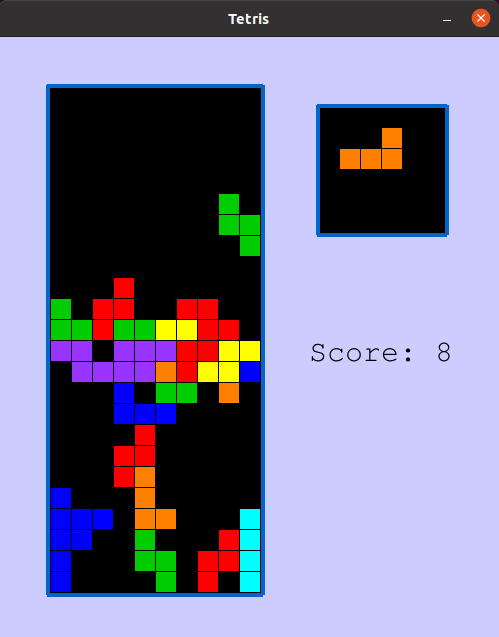

# Q-Learning agent for playing Tetris in Python.

## What is it?

This is a simple implementation of Tetris that allows both a human player and an AI bot to play. It also contains an implementation of a Deep Q-Learning based bot that learns from its play getting a raw Tetris board as an input.

[Here you can see how the trained Agent copes with his task.](https://www.youtube.com/watch?v=kHIpl0Dpbgw)

As you can see on the video, it may be a bit surprising that the Agent does not care about the lower half of the board. At the beginning of the game, he sets the blocks almost randomly until half of the board is filled, and then he starts playing seriously.

## Instructions on How to Run

To run this code you need to satisfy the following dependencies:
 - `Python 3`
 - `NumPy`
 - `Tensorflow`
 - `Matplotlib` 
 - `Pygame` 

If you want to play Tetris yourself, just run `python Tetris.py`.
To see how my trained Agent handles this task, run `python TetrisPlayDQN.py`.
If you want to train the agent yourself, run `python trainDQN.py`.
 

## Q-Learning Agent

The implemented **Reinforcement Learning** strategy uses approximate **Q-Learning** to make moves. The training runs are generated using the  `eps`-greedy strategy.

The state representation is the same as for the **Reinforcement Learning Agent Ben** ([click here for Ben's implementation](https://github.com/MartaStraszak/TetrisReinforcementLearning)). The state in the game is a pair `(Board, Piece)` where `Board` is the full state of the board (a rectangular bit array saying which cells are occupied) and `Piece` is one of `['I','J','L','O','S','Z','T']` representing which piece is being dropped at the moment. An action is represented by `horizontal position` + `rotation` which we think are applied instantaneously when the new piece shows up. This is a certain simplification (as normally you can move the piece left and right during the drop and then possibly “fit” it in some gap) but it only reduces the possibilities of the agent (and in particular the agent is not cheating in any way). This simplification is made to make the space of actions smaller and consequently to better model the problem using RL techniques.

Since the set of states is exponential in size, we cannot use “exact”  **Q-learning** but need to make na approximation to the **Q-value** function. More specifically, for a state-action pair `(s, a)` let `B` be the board state that results in applying the action `a` to state `s`, we then approximate `Q(s,a)` by `F(B)`, where `F` is a **convolutional neural network**. 

In contrast to Ben, this Agent does not get any extra tips on how to play (i.e. the number of “holes”, the height of columns, e.t.c.). He only gets as an input a raw board and the rewards:

 1. `0.1` for every step he does not lose,
 2.  additionally `1` for every full line,
 3. `0` if he loses.

This explains his strategy of playing only on the second half of the board. Whatever he is doing in the first half of the board, does not affect losing in the short term, hence he does not care.